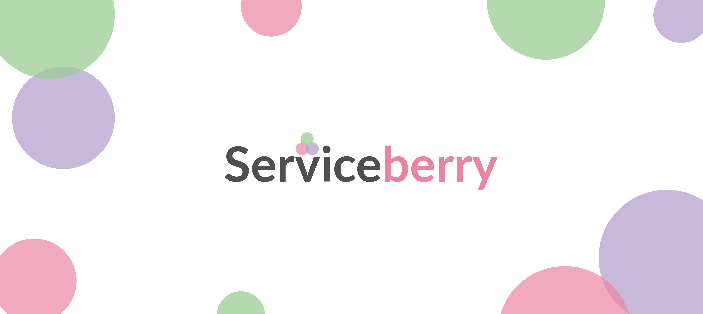
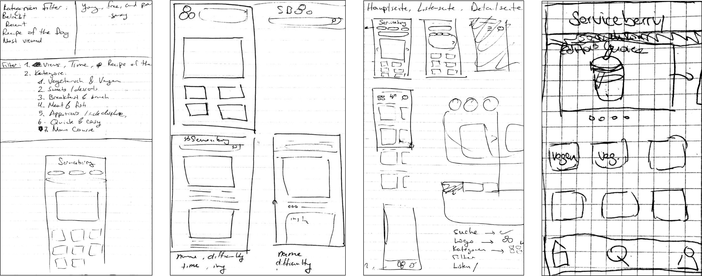
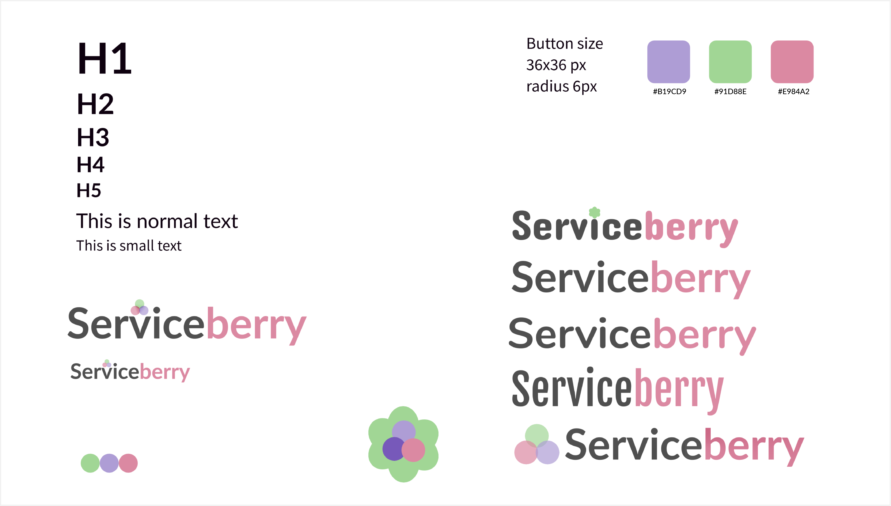

## Summary
---
**+Ongoing project - currently on hold+**

Two of my friends and I want to create a single page application (SPA) that stores recipes that we can easily access. We chose SPA because of its many advantages, e.g., loaded resources at the launch of the app don't need to be reloaded during usage.  
As students, we are often haphazard about what to cook, and having a (web) app with our go-to recipes could help us decide.

I was mostly involved in the UI process - coming up with the color palette, fonts, and the design in general.

**Methods:** Brainstorming, Wireframes, Prototyping

**Tools:** Figma, Python, TypeScript, Vue, CSS, HTML, JavaScript

## Process
---
### Design Thinking

Research - Define - Ideate - Prototype - Iterate

## Research
---
To get a better understanding how websites and apps in this specific field look like, we conducted analyses on various popular cooking and recipe sites on the market. We found out that there are different types of websites: those that tell stories, that are blog-like, (and mixes of them), some that seem more of an e-commerce website, a collection of recipes, and those that are a blend of everything.  
Since our goal is not to sell but to gather our favorite recipes, we will focus on creating a **clear** and **straight-forward** website. During our research, we found that a lot of websites are crowded with advertisements of all sorts, and it was hard to navigate the jungle of blog entries and promotions. Especially when it comes to apps, we want it to be as **simple** and clear as possible for a pleasant UX.

## Define
---
While developing this application, we want to serve our needs first since we will be the end users. We collected features that we would like the app to have and decided to implement these in our first phase:

- search and browse function,
- popular, new, and recommended page,
- filter by difficulty, category, cooking time,
- profiles to add to favorites, and
- later on, be able to create recipes (for now only a set of recipes).

## Ideate
---
### Low-fidelity wireframes
We quickly constructed numerous wireframes with pen and paper, imagining how we envision our core features to look together and mix-match the elements to satisfy user needs.

### High-fidelity wireframes
Our high-fidelity screen designs are made in Figma. We are still in the early process, so they might still be inconsistent.

#### Desktop screen designs

../assets/Serviceberry/SB_DHomeScreen.png
../assets/Serviceberry/SB_DMainCourse.png
../assets/Serviceberry/SB_DRecipeView.png



#### Mobile screen designs

The designs can be viewed in detail [here](https://www.figma.com/file/DdXyA5Ja5A3DQvEX1dySGz/Serviceberry?node-id=0%3A1){:target="_blank"}

### Design System
We created a design system to guide us when designing to ensure consistency throughout the platforms. It is not completely set yet, there are still variations in logo and font because we are still in the developing phase.

