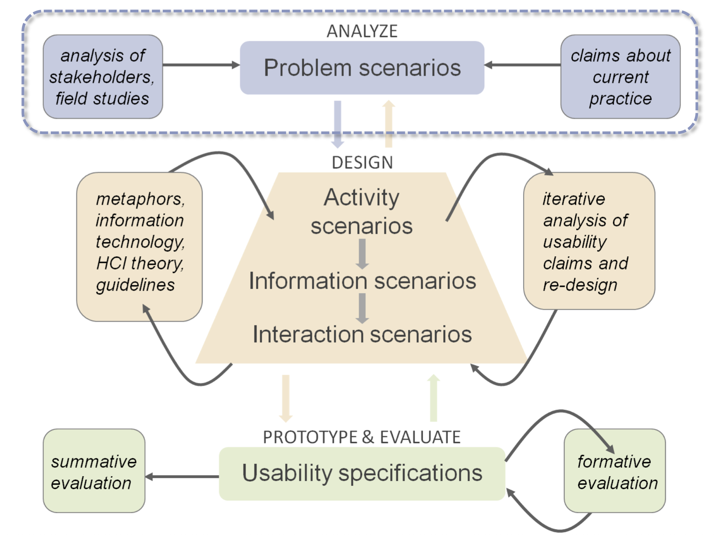
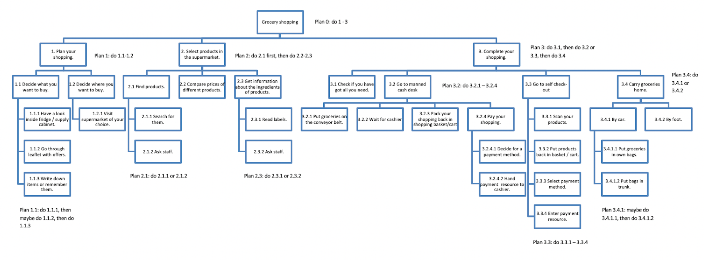
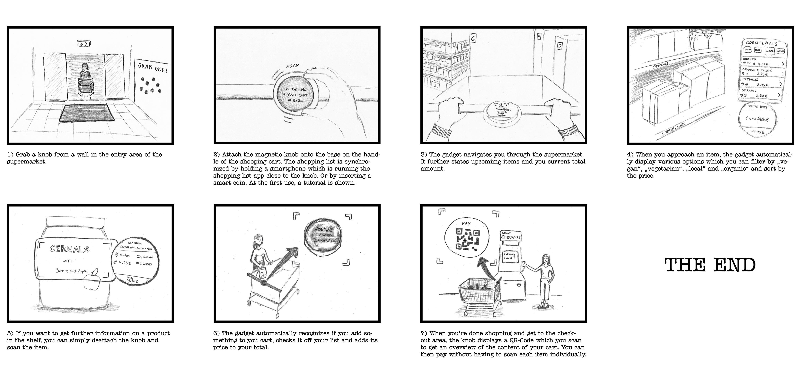
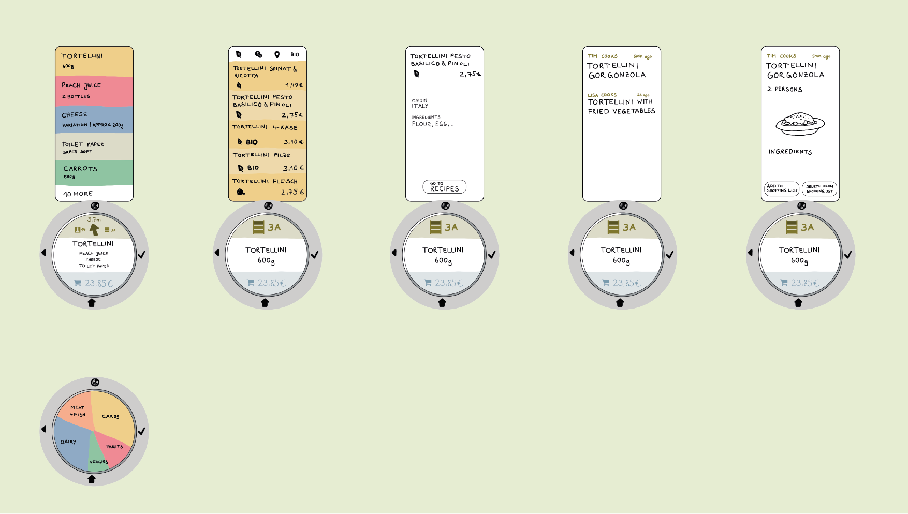
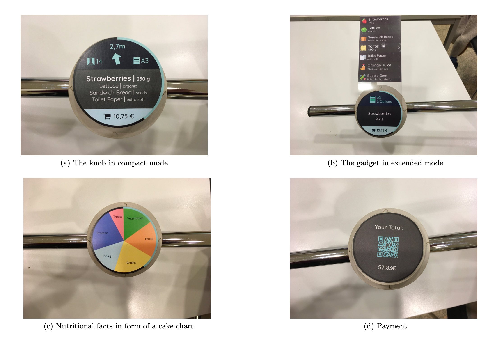

## Background information
---
As part of the coursework *User Interface Engineering*, a concept for a smart gadget to support people in adopting a healthier lifestyle is to be developed. The project group of five students with backgrounds in either computer science or psychology.  
The goal of the project is to implement a prototype, to test, and present the outcome within one semester. The applied method for the workflow is the scenario-based design by Rosson and Carroll, and encompasses an analysis phase, a design phase, and a prototype and evaluation phase.

I was actively involved in almost every part of the process, especially when creating personas, their respective scenarios, and the development of the functionality of the gadget. Furthermore, I shot and edited the demo video for our physical prototype.

**Methods:** Brainstorming, Field studies, Interviews, Stakeholder diagrams, Creating personas, Scenarios, Storyboard, Wireframes, Prototyping, Usability tests

**Tools:**  Adobe Illustrator, Adobe Premiere

## Context
---
When we brainstormed which aspects a healthy lifestyle compromises, there were many facets that we could cover. We had various visions and ideas and found out that many already exist (in some form) and decided that stress is a factor we face and relate to a lot in our daily lives. In further discussions, we decided to develop a gadget that will reduce stress when grocery shopping. The idea is to have an additional attachment to the handle of a shopping cart that synchronizes your shopping list and guides you to the aisles in an efficient manner. Recipes can be looked up on the spot and added to the list. Moreover, the gadget scans all items, and the checkout is readily done cashless for an easy and hassle-free shopping experience.

## Process
---
Scenario-based Usability Engineering

<!--  -->

## Analysis Phase
---
### Field studies 
To get a better understanding of supermarket environments, we undertook field studies. We observed that grocery shopping is part of nearly everyone’s life and shops for groceries differ, e.g., in large, offer, quality of products, etc. Also, we classify three kinds of shops: small markets, medium-sized markets, and hypermarkets. In the latter two, people seem to be more stressed. 

### Interviews
Interviews were held to get a better picture of different user groups. We asked only a small group of seven users who might not be representative of the overall society. Nonetheless, we were able to determine a few **key findings** to help our project:

(1) Interviewees tend to have higher stress levels during shopping, especially when the supermarket is too crowded, there are "annoying people" around, and forget products.  
(2) Suggestions to enrich the shopping experience are less crowded supermarkets and a shopping aid.

### Stakeholders
After conducting field studies and interviews, we revisioned our stakeholders and their general group characteristics regarding background, expectations, and preferences. We designed the stakeholder diagram accordingly.

### Personas
Personas are typically the hypothetical stakeholders, i.e., possible customers in any kind of supermarket. We created three personas with their respective background, expectations, and preferences.


../assets/PersonaEmma.png
../assets/PersonaSusan.png
../assets/PersonaRoger.png



### Hierarchical Task Analysis (HTA)
To analyze specific tasks, the main task of grocery shopping is divided into three subparts: planning the shopping trip, selecting products while in the supermarket, and concluding shopping. A hierarchical listing of the specified tasks can be seen in the image below.

## Design Phase
---
### Activity design
The activity design transforms current activities to envision new design ideas. It provides a concrete glimpse of the future that shall be enabled and deliberately focuses on pure functionality. For this, we created problem scenarios that will be transformed into activity design scenarios.


../assets/ADEmma.png
../assets/ADSusan.png
../assets/ADRoger.png



### Information design
Information design scenarios are elaborations of activity scenarios that provide details about the information that the system will provide to users. Those new scenarios involve many complexities and make sense of how users perceive and interpret information.


../assets/InfDEmma.png
../assets/InfDSusan.png
../assets/InfDRoger.png



### Interaction design
The interaction design describes the details of user action and feedback. It specifies the action sequences for planning and achieving one or more task goals like conveying what system goals are possible, plans for accomplishing them, and physical actions to execute. Each interaction scenario is a fully-specified design vision:
- the users and task(s) being supported,
- the information needed to carry out the task,
- the actions the users take to interact with the task information, and
- the responses the system provides to users' actions.


../assets/IntDEmma.png
../assets/IntDSusan.png
../assets/IntDRoger.png



### Storyboard
The storyboard describes how to use the gadget during shopping.

## Prototype & Evaluation Phase
---
### Paper prototype
We sketched out our low-fidelity prototype and imagined our gadget to like the following:

### Screen design prototype
After further development, our high-fidelity prototype looks like this:

../assets/UIEPrototype1.png
../assets/UIEPrototype2.png
../assets/UIEPrototype3.png



### Physical prototype
We created our prototype with a lasered boxboard. It can be attached to different objects with a hook-and-loop fastener. A fixed base with the main icons (simulating a smart scanning system) is attached to the knob via magnets. The knob consists out of two parts: a fixed part, where a transparent sheet of plastic could be attached (incl. different paper displays), and a movable part to simulate scrolling.

### Usability tests
**Method:** We chose “Think-Aloud” as a formative empirical method. The user tests were conducted in a laboratory setup. To present the information flows to the user, we follow “Controlled Experiments”. In addition, we used usability inspections to find problems evolving by the usage. The usability tests were conducted by providing the test persons with a basic prototype of the gadget. Since it is just a basic prototype and does not allow proper interaction the collected data is qualitative.

**Participants:** Due to time constraints, we only conducted a small number of user tests. However, when choosing test persons we considered selecting from a variety of age groups and fields. For our user study, we recruited six participants (2 male, 4 female) aged from 22 to 49. Four of them are students, the other two working employees.

**Procedure:** First, subjects were given Part I of the questionnaire which asks for personal information about their current shopping behavior. After completing the form, subjects were given the prototype and introduced to the basic functions of the gadget by the examiner. They had to complete the following tasks:
- Task 1: Find the cheapest tortellini option.
- Task 2: Where do the 4-Cheese Tortellini come from?
- Task 3: Find a recipe for 4-Cheese Tortellini and add some of the recipe ingredients to your shopping list.
- Task 4: Go back to the home screen.

After finishing the tasks, participants were given Part II of the questionnaire which evaluates the usability of the gadget. While the participants were working on the tasks and thought out loud, the examiner completed the form for observations.

**Results:** Due to time constraints, we only conducted a small number of user tests. However, when choosing test persons, we considered selecting from a variety of age groups and fields. For our user study, we recruited six participants (2 male, 4 female) aged from 22 to 49. Four of them are students, the other two working employees.

    

        
Read more...

        Although most participants use their smartphones for almost everything, only one-third uses a digital shopping aid. Most of them spend rather less time grocery shopping. Participants rated the gadget as rather easy and were satisfied with the usage on average. Some difficulties were arising from the free text data as well. The main difficulties were applying the recalling of the icons and the extraction of the display. Also, some confusion about the meaning and usage of icons and buttons arose. The navigation system and the ordering function were mostly viewed as very helpful and efficient. Most participants liked the further options of the gadget like getting recipes and information about, e.g., the origin of a product as well as having a smart scanning system. On top of that, many participants liked the handy size of the gadget. We could figure out discordances about the system input: some participants liked the input we designed, but others would prefer touch screens.  
        The observations of the examiner supported the subjective evaluation of participants. We could observe hesitation and comments that expressed uncertainty about the meaning of icons. Moving the knob to the right/left for confirmation/going back seemed not intuitive in some cases; participants did tapping gestures like they would on a smartphone. But we also could observe that most of them managed the tasks without problems. The options of the gadget received positive comments: most people liked searching for recipes and, e.g., carbon footprint. Some of the named difficulties are owed to the usage of our prototype itself: the extraction of the display or the imagination of scrolling through a product list. Another critique is about the study setting: to conclude if our gadget effectively can reduce stress for customers, the study should be repeated in a supermarket with an enhanced prototype, so that we can measure the stress experience with and without the gadget.  
        In conclusion, the data indicate that some difficulties arise when participants use the gadget. Nevertheless, generally, participants appreciated a lot of the included features. Collected data will help to make further improvements in the future.
    

## Retrospective
---
### Conclusion
We started an idea about fostering a healthy lifestyle with the support of a smart gadget focusing on reducing stress while grocery shopping since it is a daily and relatable topic.
We believe that the gadget we developed can reduce stress in two ways: when people don't have much time, the gadget can support doing grocery shopping in a fast manner, so there is no wasted time that could lead to stress. And when people do have more time for grocery shopping, the gadget can enhance motivation, creativity, and learning by different functions, so that shopping is experienced positively and not stressfully. To which extent the gadget can truly reduce strain through experienced stress while grocery shopping should be analyzed in further studies.

### Challenges
Aside from creating an innovative product, compromising on one idea and its functions in a five-member group was challenging. We had many visions that we wanted to realize but had to come to terms with one design since we only had one semester to accomplish the intensive workload of this coursework along with other modules. Furthermore, the dedication and apportionment of work were not distributed evenly at times resulting in more work for some than others.

### Improvements
Improvements that we think could be implemented in the next phases:

- more distinct and easily recognizable icons,
- add products spontaneously,
- a more logical menu list, and
- a clear and simple tutorial.

Besides, I think that setting deadlines and communicating effectively and efficiently within the group can help to keep an overview and reduce misunderstandings. An assigned leader who manages and delegates tasks would be beneficial in every group as well.

---
For more details and the documentation of the project click [here](../assets/UIE_Team_B-final-doc.pdf){:target="_blank"} and the demonstration video [here](https://drive.google.com/file/d/1Z1Crp5Tbkhn9uvJLXRbBw2laajxLxQhb/view?usp=sharing){:target="_blank"}.

<!--
For the whole documentation of the project click [here](https://drive.google.com/file/d/1txb8SuudHFkJKl-hWmU-Jmuya5ranJPS/view?usp=sharing){:target="_blank"}
-->